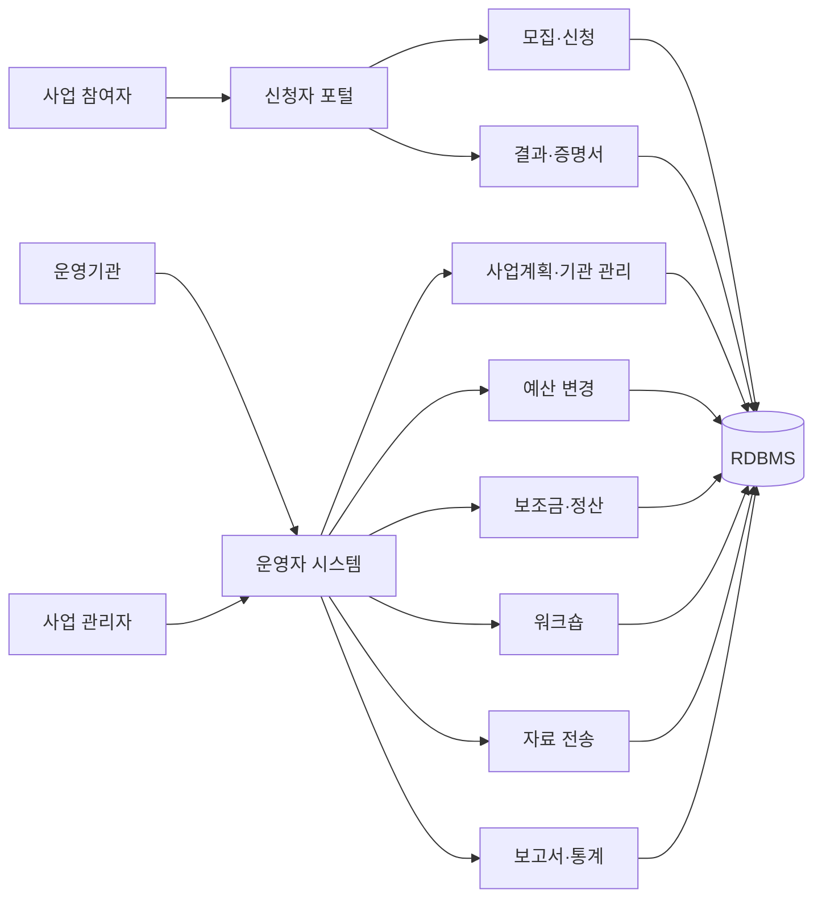

# 교육사업 통합 운영 시스템

교육사업의 모집과 신청, 운영기관 관리, 예산 변경, 보조금·정산, 워크숍, 운영자료 전송과 결과 확인을 관리하는 웹 시스템입니다.

신청자 기능과 운영자 관리 기능을 함께 개발했습니다. 신청 정원 검증, 예산 변경 이력, 보조금 반환, 정산자료 전송, 워크숍 안내, 대량 메일과 보고서 출력 기능을 주로 담당했습니다.

## 시스템 구성

## 내가 개발한 기능

### 모집과 신청

- 신청 가능한 사업계획과 진행 중인 모집 조회
- 신청자 기본정보 확인
- 운영기관 정원과 시험실 수용 인원 검증
- 신청정보, 수험번호, 설문과 답변 일괄 저장
- 체험 신청과 일반 신청 흐름 분리
- 신청 완료·취소 메일 발송
- 신청 취소와 사진 변경
- 신청 결과와 성적증명서 조회·출력

### 사업계획과 운영기관

- 사업계획 등록·수정·삭제와 상세 조회
- 지역·기관별 신청 현황 관리
- 담당자 변경 신청과 상세정보 조회
- 모집 데이터와 운영자료 조회
- 계획 파일을 기준으로 시험 구성과 답지 상태 확인

### 예산 변경

- 기관별 예산과 운영비 세부내역 조회
- 예산 변경 신청 등록과 상태 변경
- 변경 전·후 금액 비교
- 예산 변경 이력 조회
- 관리자 화면과 기관 화면의 처리 범위 분리

### 보조금·정산과 자료 전송

- 보조금 반환 목록과 처리 상태 관리
- 계좌 확인과 배송 주소·수량 확인
- 정산자료 전송 목록과 엑셀 다운로드
- 반려 사유 저장과 반려 안내 메일
- 승인 시 환율·정산 관련 값 갱신
- 답안 수합과 운영자료 상태 관리

### 워크숍과 대량 안내

- 워크숍 대상 목록과 신청 정보 조회
- 대상자별 안내 메일 발송
- 수신자 정보·템플릿·필수 값 검증
- 발송 성공 시 발송일시 갱신
- 실패 대상 목록을 별도로 반환해 재처리 가능하도록 구성

### 보고서와 공통 기능

- 성적과 신청 결과 보고서 조회
- 보고서 출력 이력 기록
- 시험지 유형별 목록·상태·규칙 관리
- 공지사항, 답변, 쪽지와 사용자 검색
- 운영자·사용자 화면의 권한별 경로 처리

## 구현 사례

실제 담당 기능의 처리 구조를 Java 17로 다시 작성했습니다. 원본 소스와 운영 데이터는 포함하지 않았습니다.

| 담당 기능 | 구현 방식 | 코드 |
|---|---|---|
| 교육 신청 | 정원 확인 후 신청·설문을 하나의 저장 단위로 처리 | [EnrollmentService](samples/business-operations/src/main/java/com/portfolio/education/enrollment/EnrollmentService.java) |
| 예산 변경 | 금액 합계 검증, 상태 전이 제한, 변경 이력 생성 | [BudgetChangeService](samples/business-operations/src/main/java/com/portfolio/education/budget/BudgetChangeService.java) |
| 대량 안내 | 수신자별 검증·발송 결과를 성공과 실패로 분리 | [BulkNotificationService](samples/business-operations/src/main/java/com/portfolio/education/notification/BulkNotificationService.java) |
| 정산 승인·반려 | 제출 상태 검증, 환율 반영, 반려 사유와 이력 관리 | [SettlementService](samples/business-operations/src/main/java/com/portfolio/education/settlement/SettlementService.java) |

상세 담당 내용은 [기여 내역](docs/CONTRIBUTIONS.md), 처리 흐름은 [구현 상세](docs/IMPLEMENTATION.md), 기능과 코드의 연결은 [기능별 구현 근거](docs/FEATURE-MATRIX.md)에 정리했습니다.

## 기술 구성

| 구분 | 사용 기술 | 적용 영역 |
|---|---|---|
| Backend | Java, Spring MVC, 전자정부표준프레임워크 | 신청·예산·정산 업무 처리 |
| Data Access | MyBatis | 운영 목록, 이력, 통계 조회 |
| Database | 관계형 데이터베이스 | 신청, 기관, 예산, 정산 데이터 |
| View | JSP, JavaScript | 신청자 포털과 운영자 화면 |
| Messaging | 메일 템플릿과 발송 서비스 | 신청·반려·워크숍 안내 |
| Document | 엑셀, 리포트 도구 | 정산자료와 증명서 출력 |
| Build | Maven | 빌드와 배포 산출물 관리 |

## 추가 설계 문서

- [문제은행 업무 흐름과 화면 설계](docs/QUESTION-BANK-WORKFLOW.md)

회사 소스, 기관명, 개인정보, 내부 주소와 운영 설정은 포함하지 않았습니다.
